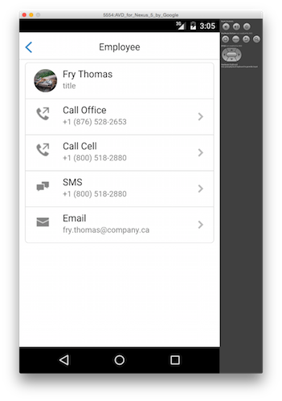

Based on ccoenraets's [cordova-tutorial](https://github.com/ccoenraets/cordova-tutorial). I used [JSON Generator](http://beta.json-generator.com/) and the code below to generate random user data, and [Lorem Pixel](http://lorempixel.com/) to generate the user pics.

```
[
  {
    'repeat:12': {
      id: '{{index()+1}}',
      firstName: '{{firstName()}}',
      lastName: '{{surname()}}',
      managerId: 0,
      managerName: "",
      title: "title",
      department: "Corporate",
      cellPhone: '+1 {{phone()}}',
      officePhone: '+1 {{phone()}}',
      email: function (tags) { return (this.firstName + '.' + this.lastName + '@' + 'company' + tags.domainZone()).toLowerCase();
      },
      city: '{{city()}}',
      pic: function (tags) { return this.firstName + '_' + this.lastName + '.jpg'; },
      twitterId: function (tags) { return '@'+ this.firstName; },
      blog: "http://greynetic.com"
    }
  }
]
```




